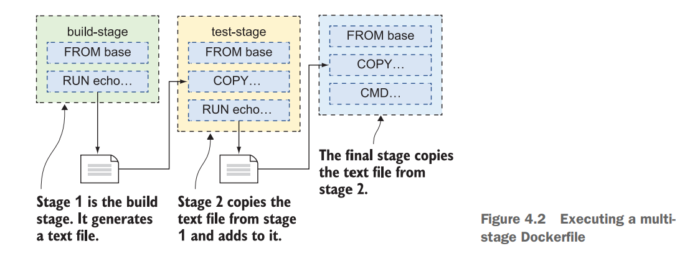

# Table of contents
- [Docker. How much do you know?](#preface)
- [Basics of Docker](#basics)
- [Python Example](#python)

# 1.0 - Docker. How much do you know?  <a name="preface"></a>

If you are software engineer with some experience, it's very likely that you would have had some exposures to [Docker](https://www.docker.com/). But if you think about it, distributed systems, and containers have pretty much taken over the world, and essentially every applications out there is containerized these days. Naturally, there are immense amount of contents associated with Docker beyond simple image build, pull, etc, and a lot of the sophisticated tools like [Kubernetes](https://kubernetes.io/docs/tasks/access-application-cluster/web-ui-dashboard/), [Terraform](https://www.terraform.io/), [Ansible](https://www.ansible.com/), and etc operate on top of containers. My manager asked how much I know about Docker oneday, and to be honest I did not know how much I knew about it either. So that is why I decided to start reading a popular book called [Learn Docker in a Month of Lunches](https://github.com/sixeyed/diamol), and check how much I know about Docker, and fill up any gaps that might exist in my knowledge. 

<figure>

<figcaption>The difference b/w Vms and Docker Containers</figcaption>
</figure>

I am not going over the conceptual aspects of Docker in detail, but to give you a high-level overview, Docker is open source platform that offers container services. Containers are lightweight Virtual Machines (VM), and they leverage features of the host operating system to isolate processes and control the processes’ access to CPUs, memory and desk space. Unlike VMs that uses hypervisor that virtualizes physical hardware, containers virtualize the operating system (typically Linux or Windows) so each individual container contains only the application and its libraries and dependencies, allowing the applications to be ran on any operating system without conflicts.

And typically applications would have more than one containers running. Application would consist multiple instances of containers (i.e Microservices) that are in charge of different aspects of the app, hosted in the virtual cloud like Elastic Container Registry (ECR), talking to each other over virtual network without being explosed to the internet.


# 1.1 - Basics of Docker <a name="basics"></a>

Okay now we reviewed what Docker is, and why we are using it. Let's do the very basics according to the outline of the book. Assuming you have [Docker installed in your environment](https://docs.docker.com/desktop/install/linux-install/) already, let's dive straight to it. I won't even bother pulling pre-existing images and doing interactions with them, because I assume that we all already know how to do that. 

```bash
#pull the docker images hosted on dockerhub already.
$ docker image pull diamol/ch03-web-ping

#run the ping application
$ docker container run -d --name web-ping diamol/ch03-web-ping

#check the logs collected by Docker
$ docker container logs web-ping

# tear down the container
$ docker rm -f web-ping

# run a version that pings to specific target, google in this case. 
$ docker container run --env TARGET=google.com diamol/ch03-web-ping
```

Now, to write a Dockerfile that does above, we obviously need to write a Dockerfile. We can simply create one mirrowing the Image we have pulled from DockerHub. Refer to the Dockerfile. 

```bash
FROM diamol/node
ENV TARGET="blog.sixeyed.com"
ENV METHOD="HEAD"
ENV INTERVAL="3000"
WORKDIR /web-ping
COPY app.js .
CMD ["node", "/web-ping/app.js"]
```
This copies the app.js file, and executes the code via CMD method. You can see that app.js file is looking for environment variables.

```js 
const options = {
  hostname: process.env.TARGET,
  method: process.env.METHOD
};
```

Build the code, and execute the same code:

```bash
$ docker image build --tag test .
$ docker container run --env TARGET=google.com test
```

Very easy. Next up, you have multi-stage Dockerfile that uses Java Application. 

**Working with multi-stage Dockerfile**
Each stage starts with a FROM instruction, and you can optionally give stages a name with the AS parameter. In this example that uses JAVA, Maven is a build automation tool used primarily for Java projects. OpenJDK is a freely distributable Java runtime and developer kit. Maven uses an XML format to describe the build, and the Maven command line is called mvn. We can package everything together like this run make process, such as compiling and running applications in one go. 

<figure>

<figcaption>You don't need to know Java. The point is to see how the data flows.</figcaption>
</figure>

First pull the base images. 

```bash
$ docker pull diamol/maven
$ docker pull diamol/openjdk
```

```bash
FROM diamol/maven AS builder
WORKDIR /usr/src/iotd
COPY pom.xml .
RUN mvn -B dependency:go-offline
COPY . .
RUN mvn package

# app
FROM diamol/openjdk
WORKDIR /app
COPY --from=builder /usr/src/iotd/target/iotd-service-0.1.0.jar .
EXPOSE 80
ENTRYPOINT ["java", "-jar", "/app/iotd-service-0.1.0.jar"]
```

1. The builder stage starts by creating a working directory in the image and then copying in the pom.xml file, which is the Maven definition of the Java build.
2. The first RUN statement executes a Maven command, fetching all the application dependencies. This is an expensive operation, so it has its own step to
3. Make use of Docker layer caching. If there are new dependencies, the XML file will change and the step will run. If the dependencies haven’t changed, the
layer cache is used.
4. Next the rest of the source code is copied in—COPY . . means “copy all files and directories from the location where the Docker build is running, into the working directory in the image.”
5. mvn package compiles and packages the application. This creates `Jar` file.
6. The app now copies compiled JAR file from the builder.
7. App exposes port 80.
8. ENTRYPOINT is alternative to CMD operation, executing compiled JAVA file. 

Alright. I get everything that is happening. But you can't really learn just by following examples. You gotta make your own example.

# 2.0 - Python Example <a name="python"></a>

1. Python code that does center crop
2. Pass the original image and cropped image to the server container
3. Server container displays the data

https://github.com/leblancfg/autocrop