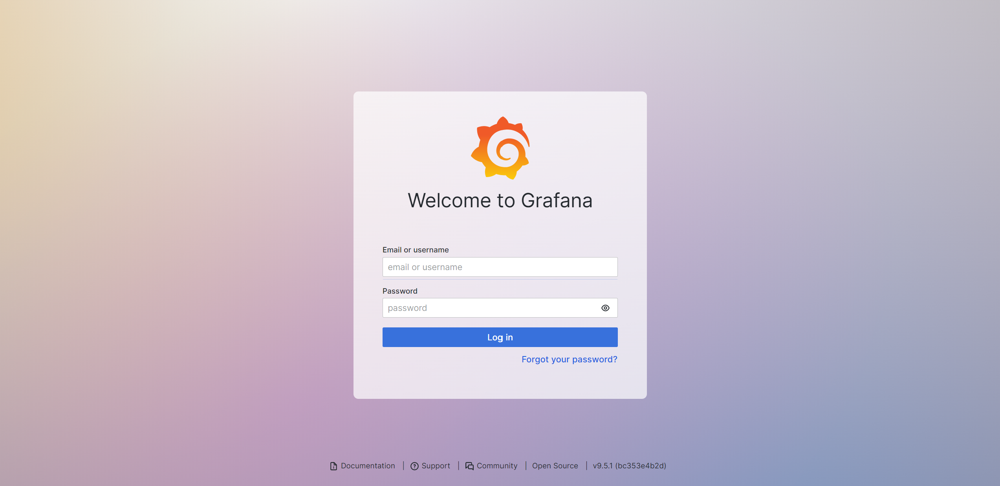
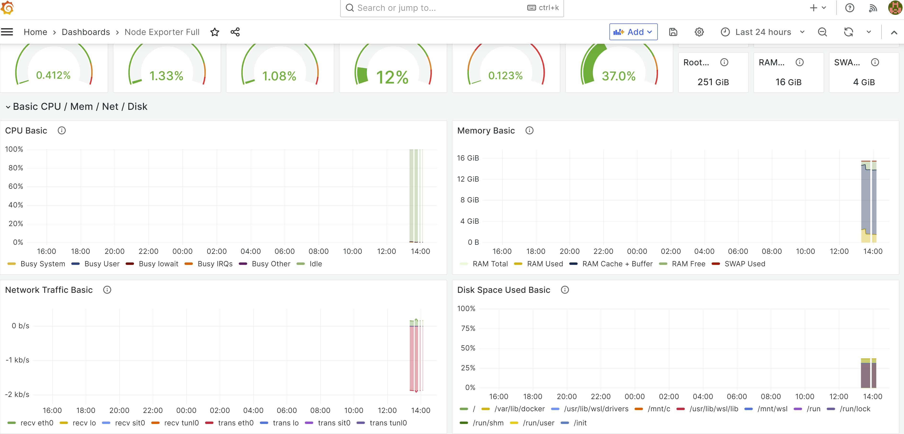
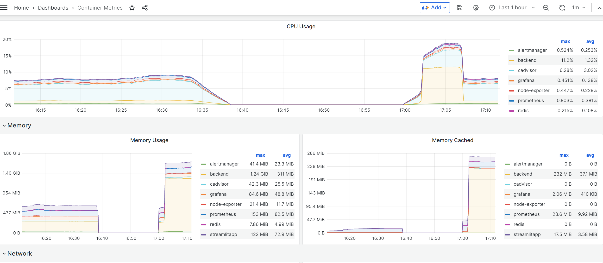
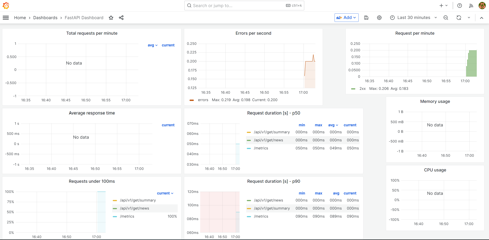

# Table of contents
- [Monitoring the containers](#monitoring)
- [Changing Docker Compose for Monitoring](#monitor)
- [Configuring Grafana](#grafana)
- [Configuring Prometheus](#prometheus)
- [Configuring Cadvisor](#cadvisor)
- [Configuring Node Exporter](#node)
- [Grafana Dashboard](#dashboard)
- [Add Backend data to Grafana](#backend)

## 1.1 - Monitoring the containers <a name="monitoring"></a>

It is important to be able to monitor the containers. Containerized apps are more dynamic--they may run across dozens or hundreds of containers that are shortlived and are created or removed by the container platform. You need a monitoring approach that is container-aware, with tools that can plug into the container platform for discovery and find all the running applications without a static list of container IP addresses. Unfortunately there isn't one silverbullet framework that can handle all the monitoring by itself (at least those that are open source), but by combining multipe different frameworks, you can create very solid monitoring environment. Monitoring becomes increasingly important when you try later to scale the app using Kubernetes. 

[A.Prometheus](https://prometheus.io/)

<figure>

<figcaption>Think of Prometheus as the heart of application monitoring</figcaption>
</figure>


Prometheus is an open-source systems monitoring and alerting toolkit, which itself is a monitoring tool. Prometheus is a self-hosted set of tools which collectively provide metrics storage, aggregation, visualization and alerting. Think about it as time series database that you can query.

[B.Grafana](https://grafana.com/)

<figure>

<figcaption>Prometheus metrics are not really human friendly. We need Grafana to visualize it. Think of it as Matplotlib.</figcaption>
</figure>


Grafana While Prometheus provides a well-rounded monitoring solution, we need dashboards to visualize what’s going on within our cluster. That’s where Grafana comes in. Grafana is a fantastic tool that can create outstanding visualizations. Grafana itself can’t store data, but you can hook it up to various sources to pull metrics from it, including Prometheus.

[C. Alert manager](https://prometheus.io/docs/alerting/latest/alertmanager/#:~:text=The%20Alertmanager%20handles%20alerts%20sent,silencing%20and%20inhibition%20of%20alerts.)

<figure>

<figcaption>Have you seen automated slack messages generated regarding your server? well that is all coming from this.</figcaption>
</figure>

(This is optional)

Prometheus has got first-class support for alerting using AlertManager. With AlertManager, you can send notifications via Slack, email, PagerDuty, and tons of other mediums when certain triggers go off.

[D. Node Exporter](https://github.com/prometheus/node_exporter)

<figure>

<figcaption>It exposes stats like cpu, diskstats, and etc.</figcaption>
</figure>

Node exporter, which as the name suggests will be responsible for exporting hardware and OS metrics exposed by our Linux host. It enables you to measure various machine resources such as memory, disk and CPU utilization. The Node Exporter is a project that is maintained through the Prometheus project. This is a completely optional step and can be skipped if you do not wish to gather system metrics. Think of this as a module to gather more data. The node_exporter is designed to monitor the host system. 

[E. CAdvisor](https://github.com/google/cadvisor)

<figure>

<figcaption>cAdvisor (Container Advisor) provides container users an understanding of the resource usage and performance characteristics of their running containers.</figcaption>
</figure>


Node Exporter is for exporting local system metrics. For Docker (and Kubernetes), you will need cAdvisor. Essentially does the same thing as Node Exporter, but scrapes data for individual containers. It is a running daemon that collects, aggregates, processes, and exports information about running containers. Specifically, for each container it keeps resource isolation parameters, historical resource usage, histograms of complete historical resource usage and network statistics. This data is exported by container and machine-wide.

## 1.2 - Changing Docker Compose for Monitoring <a name="monitor"></a>

Now that we know what each components do, it is time to make the corresponding changes. The code can be found [here](https://github.com/chophilip21/docker_test). Note that quite a few files that needs to be changed, and it takes sometime to digest what is going on. First of all, let's see the whole [Docker Compose](https://github.com/chophilip21/docker_test/blob/main/app/docker-compose.yml) script. You will realize that it became much longer, so let's break it down components by components. 

```bash
# docker-compose.yml
version: '3.8'
networks: 
  monitoring: 
    driver: bridge 

# Persist data from Prometheus and Grafana with Docker volumes
volumes:
  prometheus_data: {}
  grafana_data: {}

x-logging:
  &default-logging
  driver: "json-file"
  options:
    max-size: "1m"
    max-file: "1"
    tag: "{{.Name}}"
```
First of all, a **bridge network** is a Link Layer device which forwards traffic between network segments. A bridge can be a hardware device or a software device running within a host machine’s kernel. Docker Compose understands the idea behind running services for one application on one network. When you deploy an app using Docker Compose file, even when there’s no mention of specific networking parameters, Docker Compose will create a new bridge network and deploy the container over that network. Because they all belong to the same network, all our modules can easily talk to each other. There are other network modes like overlay used for Swarm, but we are mainly interested in bridge.
Here, a persistent volume for both `Prometheus` and `Grafana` is defined, and also some logging components are initialized. 

## 1.3 - Configuring Grafana <a name="grafana"></a>

Next up, we define our first service, Grafana, the visualization dashboard. 

```bash
services:
  grafana:
    image: grafana/grafana:latest
    container_name: grafana
    restart: unless-stopped
    environment:
      - GF_AUTH_ANONYMOUS_ENABLED=true
      - GF_AUTH_ANONYMOUS_ORG_ROLE=Admin
      - GF_USERS_DEFAULT_THEME=light
      - GF_LOG_MODE=console
      - GF_LOG_LEVEL=critical
      - GF_PANELS_ENABLE_ALPHA=true
    volumes:
      - ./configs/grafana/provisioning/dashboards.yml:/etc/grafana/provisioning/dashboards/provisioning-dashboards.yaml:ro
      - ./configs/grafana/provisioning/datasources.yml:/etc/grafana/provisioning/datasources/provisioning-datasources.yaml:ro
      - ./dashboards/node-metrics.json:/var/lib/grafana/dashboards/node-metrics.json:ro
      - ./dashboards/container-metrics.json:/var/lib/grafana/dashboards/container-metrics.json:ro
      - grafana_data:/var/lib/grafana
    depends_on:
      - prometheus
    ports:
      - 3000:3000
    networks:
      - monitoring
    logging: *default-logging

```

For Grafana, I am defining some config files for dashboard and datasources, which will be used by Grafana to display contents. These, however, do not have to be populated prior to provisioning. They can be generated after dashboard being created, which will be discussed later more in detail. And obviously the data being rendered by Grafana is all from Prometheus, so it would naturally depend on it. The convention is to use port 3000 for Grafana.

## 1.4 - Configuring Prometheus <a name="prometheus"></a>

Next up is the section for Prometheus. This is probably the most important component, as it scraps data from various components. 

```bash
prometheus:
    image: prom/prometheus:latest
    container_name: prometheus
    restart: unless-stopped
    command:
      - '--config.file=/etc/prometheus/prometheus.yml'
      - '--log.level=error'
      - '--storage.tsdb.path=/prometheus'
      - '--storage.tsdb.retention.time=7d'
      - '--web.console.libraries=/usr/share/prometheus/console_libraries'
      - '--web.console.templates=/usr/share/prometheus/consoles'
      - '--web.external-url=http://localhost:9090'
    volumes:
      - ./configs/prometheus/prometheus.yml:/etc/prometheus/prometheus.yml
      - ./configs/prometheus/recording-rules.yml:/etc/prometheus/recording-rules.yml
      - ./configs/prometheus/alerting-rules.yml:/etc/prometheus/alerting-rules.yml
      - prometheus_data:/prometheus
    depends_on:
      - alertmanager
    ports:
      - 9090:9090
    networks:
      - monitoring
    logging: *default-logging
```

The most important part of this section is that I am referring to a [prometheus.yml](https://github.com/chophilip21/docker_test/blob/main/app/configs/prometheus/prometheus.yml) file, and this gets automatically inserted into the volume of the container. This file sets rules for where Prometheus should be looking for the data.  

```bash
global:
  scrape_interval: 5s
  external_labels:
    namespace: local

rule_files:
  - /etc/prometheus/recording-rules.yml
  - /etc/prometheus/alerting-rules.yml

alerting:
  alertmanagers:
    - scheme: http
      static_configs:
        - targets: ['alertmanager:9093']

scrape_configs:
  - job_name: prometheus
    static_configs:
      - targets: [ 'localhost:9090' ]
        labels:
          container: 'prometheus'

  - job_name: alertmanager
    static_configs:
      - targets: [ 'alertmanager:9093' ]
        labels:
          container: 'alertmanager'

  - job_name: node-exporter
    static_configs:
      - targets: [ 'node-exporter:9100' ]
        labels:
          container: 'node-exporter'

  - job_name: cadvisor
    static_configs:
      - targets: [ 'cadvisor:8080' ]
        labels:
          container: 'cadvisor'

  - job_name: backend
    static_configs:
      - targets: [ 'backend:5000' ]
        labels:
          container: 'backend'
```

You can feed in IPs, or name of the component as targets. 

## 1.4 - Configuring CAdvisor <a name="cadvisor"></a>

Next up is CAdvisor and Redis service. CAdvisor requires `Redis` server to be initialized. CAdvisor will gather container metrics from this container automatically, i.e. without any further configuration.

```bash
cadvisor:
    image: gcr.io/cadvisor/cadvisor:latest
    container_name: cadvisor
    restart: unless-stopped
    privileged: true
    volumes:
      - /:/rootfs:ro
      - /var/run:/var/run:rw
      - /sys:/sys:ro
      - /var/lib/docker:/var/lib/docker:ro
      - /var/run/docker.sock:/var/run/docker.sock
    networks:
      - monitoring
    logging: *default-logging

redis:
    image: redis:latest
    container_name: redis
    ports:
      - 6379:6379
    cpus: 0.5
    mem_limit: 512m
    logging: *default-logging
```

## 1.4 - Configuring Node Exporter <a name="node"></a>

Finally a Node-exporter and Alert Manager. Alert Manager is optional, and let's dig deeper into customization later in the future. 

```bash

node-exporter:
    image: prom/node-exporter:latest
    container_name: node-exporter
    restart: unless-stopped
    volumes:
      - /proc:/host/proc:ro
      - /sys:/host/sys:ro
      - /:/rootfs:ro
    command:
      - '--path.procfs=/host/proc'
      - '--path.sysfs=/host/sys'
      - '--collector.filesystem.ignored-mount-points'
      - "^/(sys|proc|dev|host|etc|rootfs/var/lib/docker/containers|rootfs/var/lib/docker/overlay2|rootfs/run/docker/netns|rootfs/var/lib/docker/aufs)($$|/)"
    networks:
      - monitoring
    logging: *default-logging

  alertmanager:
    image: prom/alertmanager:${ALERTMANAGER_VERSION:-v0.25.0}
    container_name: alertmanager
    command:
      - '--config.file=/etc/alertmanager/config.yml'
      - '--log.level=error'
      - '--storage.path=/alertmanager'
      - '--web.external-url=http://localhost:9093'
    volumes:
      - ./configs/alertmanager/alertmanager-fallback-config.yml:/etc/alertmanager/config.yml
    ports:
      - 9093:9093
    networks:
      - monitoring
    logging: *default-logging
```

# 2.0 - Grafana Dashboard <a name="dashboard"></a>

<figure>

<figcaption>Login, and change your password</figcaption>
</figure>


Okay, finally all the components have been defined. There are quite a bit of details for each components, and understanding everything thats happening behind the scene is quite difficult. But I understand the basics now (purpose of each parts, and how they should be configured), so that's enough to get going for now. Build with docker compose, and go to `localhost:3000`. At the beginning your password and id should be both `admin`. Add sources, and based on the source, you can create any dashboard. You can look for various dashboard options [here](https://grafana.com/grafana/dashboards/).

<figure>

<figcaption>Data for our Grafana dashboard will persist, because we generated the volume for it.</figcaption>
</figure>

<figure>

<figcaption>Metrics for containers</figcaption>
</figure>

One thing to note is that source URL pointing at Prometheus (which scraps all the data) must be `http://prometheus:9090`. I tried directing to `http://localhost:9090` and was getting connection error, and it took a while to figure that out. 


# 2.1 - Add Backend data to Grafana <a name="backend"></a>

Awesome, I see some metrics being generated on Grafana, <i>but where are metrics regarding the backend?</i> I did ask Prometheus to scrap data from backend, but they are missing on Grafana. Well, they are missing because <b> I never asked backend to generate metrics in the format that Prometheus wants </b>.

Prometheus can collect multiple types of data, and you can find information about them [here](https://prometheus.io/docs/concepts/metric_types/). The Prometheus client libraries offer four core metric types:

1. **Counter**: A counter is a cumulative metric that represents a single monotonically increasing counter whose value can only increase or be reset to zero on restart. For example, you can use a counter to represent the number of requests served, tasks completed, or errors.
2. **Gauge**: A gauge is a metric that represents a single numerical value that can arbitrarily go up and down. Gauges are typically used for measured values like temperatures or current memory usage, but also "counts" that can go up and down, like the number of concurrent requests.
3. **Histogram**: A histogram samples observations (usually things like request durations or response sizes) and counts them in configurable buckets. It also provides a sum of all observed values.
4. **Histogram**: Similar to a histogram, a summary samples observations (usually things like request durations and response sizes). While it also provides a total count of observations and a sum of all observed values, it calculates configurable quantiles over a sliding time window.

Normally, in order to have your code generate above for metrics, you would need to use client libraries provided by Prometheus. There is a [General Client library for Python as well](https://github.com/prometheus/client_python#summary). However, it is much easier to use a higher level library speficially designed for FastAPI, like [Prometheus FastAPI Instrumentator](https://github.com/trallnag/prometheus-fastapi-instrumentator). Update your requirements.txt to add the instrumentator. Now you need to chnage the backend code like following:

```py
"""Simple scrapper that randomly scraps a website and gets sentences from it."""
from fastapi import FastAPI
from scrape import get_random_news
from summarize import summarize_random_news, Data
from prometheus_fastapi_instrumentator import Instrumentator
from fastapi.middleware.cors import CORSMiddleware

app = FastAPI()

app.add_middleware(
    CORSMiddleware,
    allow_origins=["*"],
    allow_credentials=True,
    allow_methods=["*"],
    allow_headers=["*"],
)


@app.get("/api/v1/get/news", status_code=200)
async def get_news():
    """Simple get function that randomly fetches a news content."""
    return get_random_news()


@app.get("/api/v1/get/summary", status_code=200)
async def get_summary(data: Data):
    """Simple get function that randomly fetches a news content."""
    return summarize_random_news(data)


Instrumentator().instrument(app).expose(app)
```

In order to use Intrumentator, you need to add middleware to FastAPI applications. A `middleware` is a function that works with every request before it is processed by any specific path operation. And also with every response before returning it. CORS inside `CORSMiddleware` stands for Cross-Origin Resource Sharing. It allows us to relax the security applied to an API. This is enough to get basics. You can import this [metrics.json file](https://github.com/chophilip21/docker_test/blob/main/app/dashboards/fastapi-dashboard.json) to view stats related to backend.

<figure>

<figcaption>If you trigger backend from front couple times, you will see stats being record to Grafana.</figcaption>
</figure>

Awesome, now we are ready to start looking into [Kubernetes on the next post](https://chophilip21.github.io/docker_part3/). 