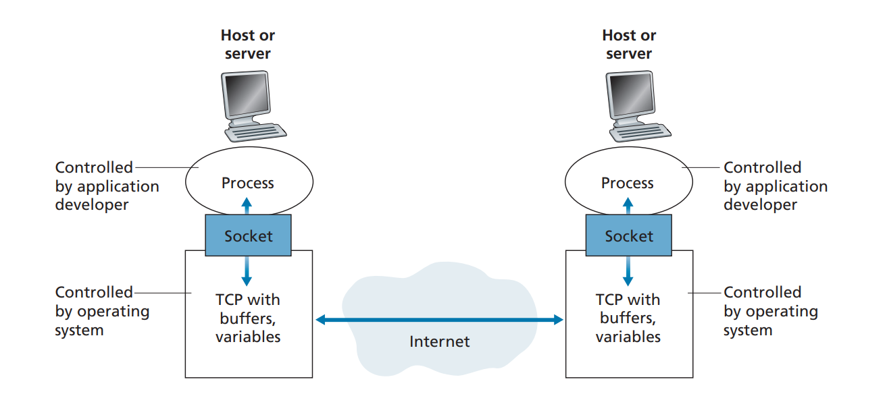
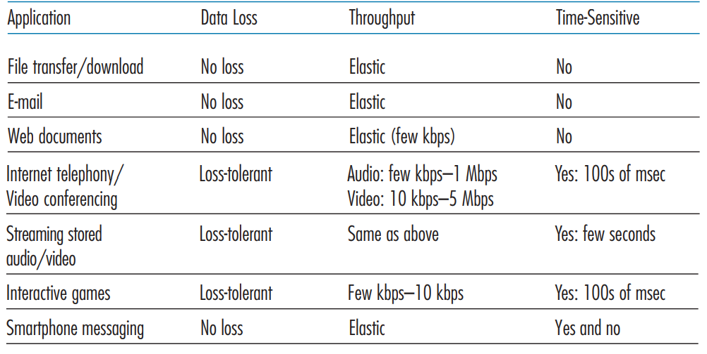

# Table of contents
- [Application Layer](#application_layer)
- [Client-server architecture](#client_server)
- [P2P archtecture](#p2p)
- [Communication Interface and Transport Protocol](#interface)
- [TCP Services (Transport layer protocol)](#TCP)
- [UDP Services (Transport layer protocol)](#UDP)
- [HTTP (Application Layer Protocol)](#HTTP)
- [HTTP (Persistent vs None-Persistent)](#persist)

While studying the basics of networking in the [previous post](https://chophilip21.github.io/openssh_part2/), I realized that there are much more underlying contents related to it that I must know as a professional software engineer. At universities, it usually takes more than one semesters two fully cover all the essential topics related to networking, something that I missed as I did not study computer science for my undergraduate studies. I wanted to fill up this gap of knowledge, and my colleague recommended ["Computer Networking: A Top-Down Approach"](http://gaia.cs.umass.edu/kurose_ross/online_lectures.htm) by James F.Kurose and Keith W.Ross. I will be summarizing the core ideas that are relevant to me, and adding my thoughts to it in the next few blog posts.

# 1.0 - Application Layer 
As the name of the book suggests, it talks about the 7 layers of the Open Systems Interconnection (OSI) model -- which describes the system that computers use to communicate over a network -- in a reverse order that is more intuitive to understand.  

<figure>

<figcaption>OSI model has seven layers. </figcaption>
</figure>

And the first layer in the OSI model is the `Application Layer,` which is the end-user layer that most of the people interact with, such as browser programs running in the user's host (desktop, laptop, tablet, phone), streaming contents from Netflix servers. When you are writing applications in languages like C, Java and Python, you just need to consider how applications talk to the network, and you never really have to consider how it would communicate within routers and other lower layers down the line. So naturally, whether than considering the entire 7 layers of the OSI model, application developers can solely focus on the `application architecture`.

## 1.1 - Client-server architecture 

The most typical `application architecture` would be the **client-server architecture**, such as Web, FTP, e-mail, and etc. Clients would request information, and when the web server receives the requests, it would respond by sending requested object to the client host. Because the server has a fixed, well-known address, and because the server is always on, a client can always contact the server by sending a request packet to the server’s IP address. Often in a client-server application, a single-server host is incapable of keeping up with all the requests from clients, so we have `data center` that hosts large number of application hosts, forming a collection of powerful virtual server. 

## 1.2 P2P Architecture 

In client-server architecture, a client would not directly interact with another client. However, in peer to peer (P2P) architecture, it is the opposite. There are minimal (or no) reliance on dedicated servers, and instead, peers (desktop and laptops controlled by users) talk to each other to exchange information, where the most typical example is the Torrent. 

## 1.3 Communication Interface and Transport Protocol 

Applications on either server or client is referred to as `processes`, and each processes have communication sockets (interface) that acts as a bridge b/w Application layer and Transport layer. 

<figure>

<figcaption>Application processes, sockets, and transport protocol</figcaption>
</figure>

**This socket is referred to as Application Programming Interface (API)**. The application developer has control of everything on the application-layer side of the socket but has little control of the transport-layer side of the socket. The only control that the application developer has on the transport layer side is:

1. the choice of transport protocol 
2. transport-layer parameters such as maximum buffer and maximum segment sizes 

**The sockets are often depicted as the Session layer in the OSI model**.  

<figure>

<figcaption>Sockets are an abstraction that transcends programming languages. Almost all languages have sockets</figcaption>
</figure>

Each transport protocol has its own pros and cons. For example, there is `Transmission control protocol (TCP)` and `User datagram protocol (UDP)`. For sensitive data that cares more about data loss, TCP protocol will be used. For interactive experience, UDP protocol will be typically used.  

<figure>

<figcaption>requirement of selected network applications</figcaption>
</figure>

## 1.4 - TCP Services (Transport layer protocol) 

TCP service model includes a connection-oriented service and a reliable data transfer service. This is where the famous 3-way handshake comes in. TCP has the client and server exchange transport layer control information with each other before the application-level messages begin to flow. This is like building a concrete bridge of connection before exchanging any information.

<figure>

<figcaption>TCP connections (via handshake), sits on top of application protocols like HTTP, FTP, SMTP.</figcaption>
</figure>

Because we have a TCP connection b/w server and host, we can have reliable stream of data. The packets data in bytes passed through socket can assure that messages arrive in correct order via TCP connection, with no missing or duplicate bytes. TCP also has traffic control system so that it does not overload network bandwidth. 

**Because TCP does not provide any encrpytion, a more secure version that uses TLS (Transport Layer Security)** exists on top of TCP, providing encrpytion, data integrity, and end-point authentication. 

## 1.5 - UDP Services (Transport layer protocol) 

UDP, on the other hand, is a lightweight transport protocol, which does not require any handshake or connections established before processes exchange information. Thus UDP does not guarantee that message will safely reach the other end, but it can pump data over to the other side in any rate it pleases, making it ideal for cases like live-streaming where being live matters more than anything else. 

# 2.0 - HTTP (Application Layer Protocol) 

Messages generated by applications go through the session layer (sockets) and reach the transport layer. **Application layer protocols define how these messages (requests, responses) get structured**. The Web’s application-layer protocol, `HyperText Transfer Protocol (HTTP)`, for example, defines the format and sequence of messages exchanged between browser and Web server. 

<figure>

<figcaption>HTTP protocols</figcaption>
</figure>

HTTP defines how Web clients request Web pages from Web servers and how servers transfer Web pages to clients. The browser is always the entity initiating the request. It is never the server. To display a Web page, for instance, the browser sends an original request to fetch the HTML document that represents the page. When the server returns the requested object, the client side parses this file, making additional requests corresponding to execution scripts, layout information (CSS) to display, and sub-resources contained within the page (usually images and videos). The Web browser then combines these resources to present the complete document, the Web page.

**HTTP uses TCP as its underlying transport protocol, The HTTP client first initiates a TCP connection with the server**. Once TCP connection is established, client packages requests with HTTP protocol, shoots it over the socket interface, which goes through the TCP layer and eventually reaches the server over the network. Server sends back the response in this manner. 

Another important thing to understand is that **HTTP protocols are stateless**. If a particular client asks for the same object twice in a period of a few seconds, the server does not respond by saying that it just served the object to the client; instead, the server resends the object, as it has completely forgotten what it did earlier. This makes no need to maintain complicated session b/w the client and server, and makes it much more scalable. 

## 2.1 - HTTP (Persistent vs None-Persistent)