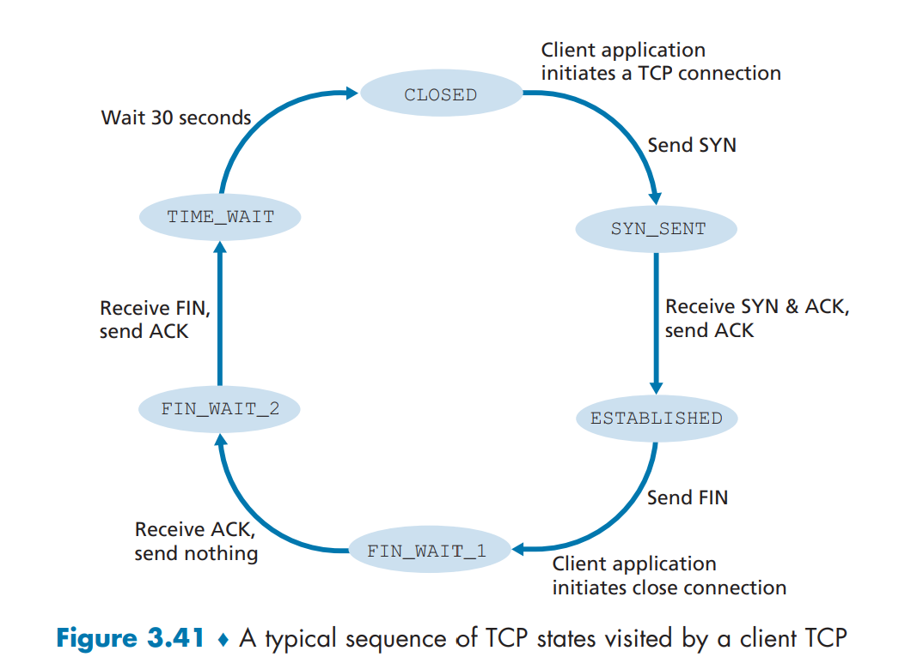
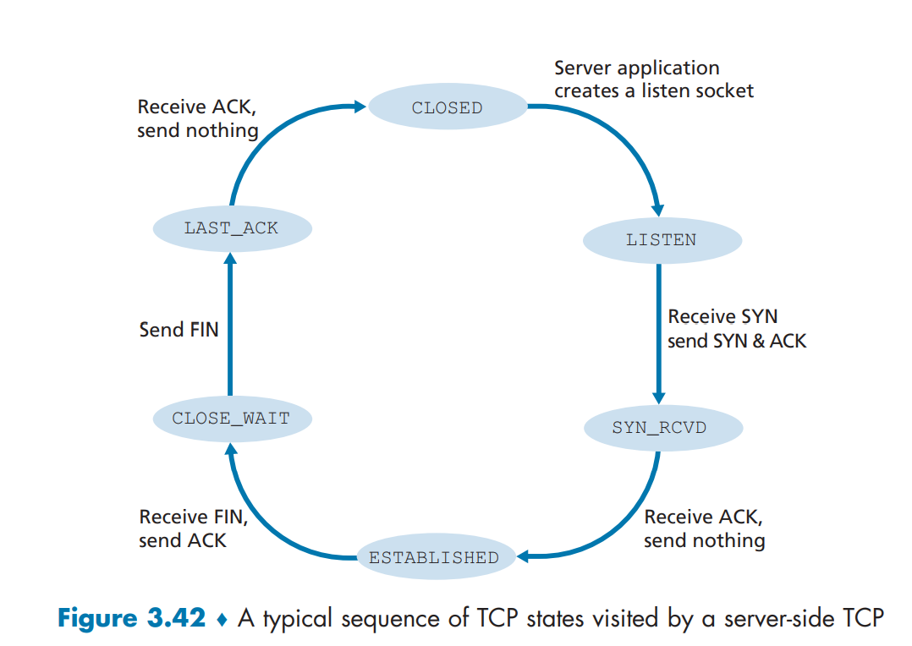

# Table of contents
- [Layer 6: Presentation layer](#presentation)
- [Layer 5: Socket programming (Session layer)](#socket)
- [Layer 4: Transport Layer)](#transport)
- [Layer 4: Multiplexing and Demultiplexing](#plexing)
- [Layer 4: Closer look at UDP](#udp)
- [Layer 4: Closer look at TCP](#tcp)
- [Layer 4: Flow/Congestion Management](#congestion)


In the [previous post](https://chophilip21.github.io/network_part1/), I have covered the basics of Networking, mostly around the top application layers of the OSI model. I will cover the lower layers of the OSI model in this post, especially on Layer 4 where many important events occur. But before diving, don't forget that OSI models are in both directions:

<figure>

<figcaption>OSI models can be interpreted in both directions, depending on who you are (sender vs receiver) </figcaption>
</figure>

Instead of uni-directional pyramid model, always think of the U-shaped bi-directional model.

# 1.0 - Layer 6: Presentation layer <a name="presentation"></a>

Let's start from looking at some of the layers below application layers. Layer 6 is presentation layer. This is a layer that the textbook does not even bother explaining (as the author regards this layer as part of application layer), but it's good to know that it exists. This is a layer that translates the data for the application layer. 

<figure>

<figcaption>Translation/Encrpytion and Compression are the main features of presentation layer</figcaption>
</figure>

Serialization of complex data structures into flat byte-strings (using mechanisms such as TLV or XML) can be thought of as the key functionality of the presentation layer. Encryption is typically done at this level too, although it can be done on the application, session, transport, or network layers, each having its own advantages and disadvantages. 
And of course, the communication flows up and down, so decryption is also handled at the presentation layer as well. Finally, presentation layer is also responsible for data compresion and decompression. 


# 2.0 - Layer 5: Socket programming (Session layer) <a name="socket"></a>

Layer 5 is the session layer. Session Layer is the first one where pretty much all practical matters related to the addressing, packaging and delivery of data are left behind—they are functions of layers four and below. It is the lowest of the three upper layers, which collectively are concerned mainly with software application issues and not with the details of network and internet implementation. The name of this layer tells you much about what it is designed to do: to allow devices to establish and manage sessions. In general terms, a session is a persistent logical linking of two software application processes, to allow them to exchange data over a prolonged period of time. In some discussions, these sessions are called dialogs; they are roughly analogous to a telephone call made between two people.

With in the layer 5, the book focuses the most on **sockets, which is an endpoint for sending and receiving data across the network (like Port number), belonging to OSI model layer 5**. 

```bash
#example of socket (protocol, local address, local port, remote address, remote port)
(TCP, 8.8.8.4, 8080, 8.8.8.8, 8070)
```

If a process is a house, process's socket is analogous to a door. To summarize: 

1. We send messages to sockets, which sends data to down the transport layer (both UDP and TCP available).
2. The unique identifier of each socket is the **port number**. 
3. When packets are generated, each packet will contain destination IP and port number, as well as source IP and port number. 
 

<figure>

<figcaption>TCP example of socket programming</figcaption>
</figure>


# 3.0 - Transport layer <a name="transport"></a>

In the application layer, messages are generated with the HTTP protocols, hits the sockets in the session layer, waiting to be carried over the network over two transport layer protocol options --- TCP/IP and UDP/IP. This is where messages are chopped into smaller segments (TCP or UDP segments), packaged as IP packets, and delivered down through the pipeline. Apart from above, there are actually several other important procedures running behind the scenes to ensure the best outcome, as TCP and UDP both use IP to communicate, but <b>IP (network layer) is unreliable, as datagrams can overflow router buffers and never reach their destination, datagrams can arrive out of order, and bits in the datagram can get corrupted (flipped from 0 to 1 and vice versa)</b>. Therefore transport layers must have logics to minimize these errors.

<figure>

<figcaption>There are many services running in the transport layer </figcaption>
</figure>


## 3.1 - Layer 4: Multiplexing and Demultiplexing <a name="plexing"></a>

An important function of transport layer, is not only to deliver a message, but it also needs to correctly deliver the message to the process requesting the message. Each process running in the application can have multiple sockets, doors used to exchange data. `Multiplexing` is the process running on the sender side, which aggregates data from each socket, and encapsulating with transport headers, passing to the network layer.   


<figure>

<figcaption>Multiplexing (server) and Demultiplexing (client) are opposites </figcaption>
</figure>

The client side operation equivalent to this is `demultiplexing`, reading the data, and sending the data to correct application layer processes waiting for the data. Each TCP/UDP segment has source port number field, and destination port number field (well known port numbers are restricted for safety), so that Multiplexing and Demultiplexing are done properly. 

<figure>

<figcaption>Multiplexing (server) and Demultiplexing (client) are opposites </figcaption>
</figure>

Generally speaking, application developers do not have to worry about these, but it's great to know about theoretical aspects of it. 

## 3.2 - Layer 4: Closer look at UDP <a name="udp"></a>

We already know that when using UDP, there is no additional procedures like doing handshakes (**This is why it's called connectionless**), so the application almost directly talks with IP. Network layer encapsulates information from UDP to datagram, and using the destination port information, it will try it's best to deliver the messages to the correct location. Unlike TCP, there is no congestion control or retry mechanism to counter dataloss. But instead, UDP just blasts away at full speed to minimize any delay in retrival of data. This is why DNS service use UDP whether than UDP, the very first thing that runs when loading browser, because the speed matters the most. 

There is minimum overhead for UDP segment structure. There are only four fields, each consisting two bytes:

- Source/dest port number
- length
- Checksum

<figure>

<figcaption>UDP has only 8 bytes of overhead, whereas TCP segment has 20 bytes of header overhead.</figcaption>
</figure>

Both TCP and UDP operate on **IP (network layer protocol), which is unreliable channel**. This is because IP protocol does not provide any functionality for error recovering for datagrams that are either duplicated, lost or arrive to the remote host in another order than they are send. This is why we take security measures in the upper layers. 

UDP does have `checksum` to determine whether bites within UDP segment have been altered (e.g accidental noise inserted when passing network/router). But the problem is, although UDP does provide error checking mechanism, **it does not do anything to recover from an error**. Damaged segment is usually just ignored, or passed with a warning. 

**Below is a very important picture to have in mind**

<figure>

<figcaption>The IP data section is the UDP segment, which itself contains header and data sections.</figcaption>
</figure>


## 3.3 - Layer 4: Closer look at TCP <a name="tcp"></a>

We looked at UDP, so of course we need to take a look at TCP as well. **Below is a very important picture to have in mind as well**. 

<figure>

<figcaption>The IP data section is the TCP segment, which itself contains header and data sections.</figcaption>
</figure>

The TCP segment (that will be discussed more down below) resides inside the IP packet of the network layer. The idea is the same as UDP. 

And also recall TCP has these features: 

**1. full-duplex service**: TCP connection established via 3 way handshake SYN/ACK each other. And this connection is full duplex. If there is a TCP connection between Process A on one host and Process B on another host, then application-layer data can flow from Process A to Process B at the same time as application-layer data flows from Process B to Process A.

**2. point to point**: transfer is always between one sender and one receiver. one sender cannot send data to multiple receiver at once. There needs to be multiple connections in that case. 

We know how the tunnel gets constructed, but how does the data actually flow from Application A (client) and Application B (server)?

<figure>

<figcaption>You need to understand how TCP buffers work.</figcaption>
</figure>


Let's say sender wishes to send 4000 bytes of data to server. These data gets encapsulated and written to the socket, and appended to `Send Buffer`. The TCP kernel break up the data into series of TCP packets. Typically, the default size of a packet on Linux systems is **1500 bytes (Maximum Transmission Unit)**, with the first **24 bytes being the packet header**; 

<figure>

<figcaption>TCP header is 20 bytes in size excluding the Options field. 12 bytes more than UDP header.</figcaption>
</figure>


This means a single packet can hold 1476 bytes of application data. To send 4000 bytes of application data, the Kernel will need to send three packets, last one containing less data than the first two. The receiving side catches these transmitted data and writes to `Receive buffer`. Application developers do not need to worry about buffer sizes, but the maximum buffer sizes can be tuned. 

**How do you know that data is being transferred correctly in order?**

<figure>

<figcaption>TCP Sequence (seq) and Acknowledgement (ack) numbers help enable ordered reliable data transfer for TCP streams.</figcaption>
</figure>


The seq number is sent by the TCP client, indicating how much data has been sent for the session (also known as the byte-order number). The ack number is sent by the TCP server, indicating that is has received cumulated data and is ready for the next segment. In this case, server responds (with ACK receipt) saying that it is now expecting sequence number 670 to be coming. The next segment the client sends has seq=670 and the len is now 1460 bytes. In turn, the server responds with ack=2130 (670 + 1460). This cycle continues until the end of the TCP session. The server knows the entire length of the data, and the order of the bytes via byte-order numbers, so if anything goes missing or comes in a wrong order:

1. either (1) the receiver (server) immediately discards out-of-order segments 
2. or (2) the receiver keeps the out-of-order bytes and waits for the missing bytes to fill in the gaps (makes much more sense to save bandwidth)

Initial sequence number (seq) is not necessarily 0. It is often chosen as a random number. Furthermore, TCP has `checksum` feature like UDP. 


<figure>

<figcaption>TCP pseudo header is first constructed and placed, logically, before the TCP segment. The checksum is then calculated over both the pseudo header and the TCP segment. The pseudo header is then discarded.</figcaption>
</figure>

<i>The CheckSum of the TCP is calculated by taking into account the TCP Header, TCP body and Pseudo IP header</i>. When the TCP segment arrives at its destination, the receiving TCP software performs the same calculation. It forms the pseudo header, prepends it to the actual TCP segment, and then performs the checksum (setting the Checksum field to zero for the calculation as before). If there is a mismatch between its calculation and the value the source device put in the Checksum field, this indicates that an error of some sort occurred and the segment is normally discarded. The sequence numbering and checksum does not necessarily solve all the problems that can happen, but it's aleast much more reliable than UDP that does not even have retry logic, and does not gaurantee that the packet will reach the destination.  

 
**3.4 - TCP Connection Management (TCP State)**

Before talking about contestion controls, let's see elaborate on how TCP makes and tears down connections. During the life of a TCP connection, the TCP protocol running in each host makes transitions through various TCP states. Let's say that client wants to establish connection with the server. 

1. `Step 1: Syn Segment`: TCP state is **CLOSED** initially. The client side sends special TCP segment (SYN bit) with no application data. Randomly chooses sequence starting number (**server_isn**) and forwards to the server. Enters **SYN_SENT** state.
2. `Step 2: SynACK Segment`: The server receives TCP SYN segment, allocates TCP buffers and variables to the connection, chooses initial sequence number (**server_isn + 1**), and sends receive acknowledgment call (SYNACK bit) back to client.  
3. `Step 3: Handshake suceeded`: Upon receiving SYNACK, the client also prepares TCP buffers and variables. Client sends last segment to the server, signaling it will start sending data. Connection entered **ESTABLISHED** state. 
4. `Step 4: Close call`: Upon finishing data transfer, the client sends the server special TCP segment that sets FIN bit to 1. By this, connection enters **FIN_WAIT_1** state.
5. `Step 5: Close received`: Server receives close call, and sends acknowledgement bit back. Enters **FIN_WAIT_2**.
6. `Step 6: Tear down complete`: Client receives ACK. TCP connection enters **TIME_WAIT** state (typically 30 seconds, but varies), which safely tears down the connection by resending tear down ACK call in case not properly sent, and releases all resouces in the client. 

<figure>

<figcaption>On the client side, the TCP state would look like this</figcaption>
</figure>

<figure>

<figcaption>The server side will also go through similar cycle.</figcaption>
</figure>


# 4.0 - Layer 4: Flow/Congestion Management <a name="congestion"></a>

Here are the last bits of the Transport layer. 

**Flow Control (Receiver imposing restrictions)**

In a typical client-server model, there is possibility that receiver overflows the receiver's buffer (which causes unwanted data drop), especially when there is difference in bandwidth, where sender can send more data than the amount that receiver can process. **Flow control matches the speed**, and this is done by sender maintaing a variable called `receive window`. Informally, the receive window is used to give the sender an idea of how much free buffer space is available at the receiver, and this would be calculated differently for every connections. Let's say host A wants to send a large file to host B. 

- `LastByteRead`: the number of the last byte in the data stream read from the buffer by the application process in B
- `LastByteRcvd`: the number of the last byte in the data stream that has arrived from the network and has been placed in the receive buffer at B
- `RcvBuffer`: Amount of extra space left in the buffer.

$$ 
\begin{align*}
rwnd = RcvBuffer - [LastByteRcvd-LastByteRead]
\end{align*}
$$

So if LastByteRcvd is 100, and LastByteRead is 50, and RcvBuffer is 60, it will receive window will be calculated as 60 - (100-50) = 10. The TCP receive window size is the amount of receive data (in bytes) that can be buffered during a connection. The sending host can send only that amount of data before it must wait for an acknowledgment and window update from the receiving host. So if there is only 10 bytes left in the buffer, it would need to wait until receiver empties and the available buffer fills up again. 

<i>UDP does not use any flow control technique, and it is only available for TCP</i>

**What is Network Congestion?**

`Network Congestion` is simply when too many sources attempt to send data at too high rate. For end-user, network congestions comes back to them as:
- High latency 
- Connection timeouts 
- Packet losses

<i>What causes congestion? </i> Well there are many reasons.

- Excessive bandwidth consumpsion
- Poor subnet management. Instead of receiving data from close-by location, you receive it from very far network. 
- Broadcast storm (sudden upsurge in number of requests to a network)
- Multicasting where data transmission is addressed to a group of destination computers simultaneously. This will cause slow down. 
- Border Gateway Protocol (BGP) that routes traffic to shortest pass, but drives everyone to the same location

**TCP Congestion Control (sender imposing restrictions)**

The cause of network congestion varies in so many different ways, and it's impossible to wait until it gets solved. So there are congestion control mechanism that exists at TCP level (<i>Obviously UDP has none of these congestion control mechanism</i>), so even if the network is not performing as well as it should, applications can still communicate as effciently as possible without worsening the problem. Flow control is imposed by the receiver, whereas **TCP congestion control gets executed by sender measuring network congestion, and automatically adjusting the rate it sends**. 

Is flow control and receive window not sufficient? Unfortunately no.

Senders would send their packets into the Internet as fast as the advertised window would allow, congestion would occur at some router (causing packets to be dropped), and the hosts would time out and retransmit their packets, resulting in even more congestion. This is why Sender also needs to know how to adjust accordingly. TCP uses something called `Congestion Window`, similar to receive window, to tell sender to slow down. 

<figure>

<figcaption>Congestion Control</figcaption>
</figure>

Congestion Windows are used by the source to limit how much data it is allowed to have in transit at a given time. There are multiple ways how to scale up and down the congestion window, and to initialze them (rapid start vs slow start, etc). Based on the observation regarding packets not delivered and timeout results, each TCP connections can measure level of congestions, and figure out how to control the windows (**addictive-increase, multiplicative decreate (AIMD)**)

There are many variations of TCP congestion control algorithms, which gave birth to things like:

- TCP Reno and TCP Tahoe (classic approach)
- TCP Cubic
- DCTCP
- CTCP
- BBR

which application developers rarely need to worry about, so will not be discussed in this post. 

On the [next post](https://chophilip21.github.io/network_part3/), I will be elaborating on the final layers of the OSI model (network, data link, physical layer), to finish off the networking series. 