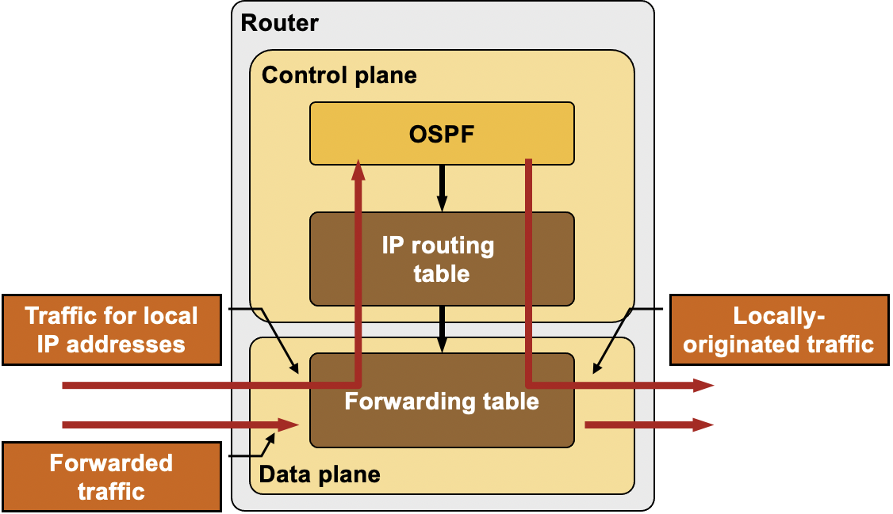
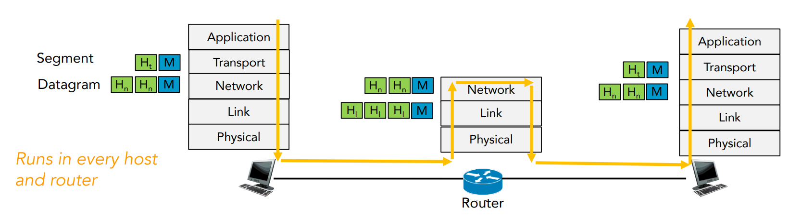
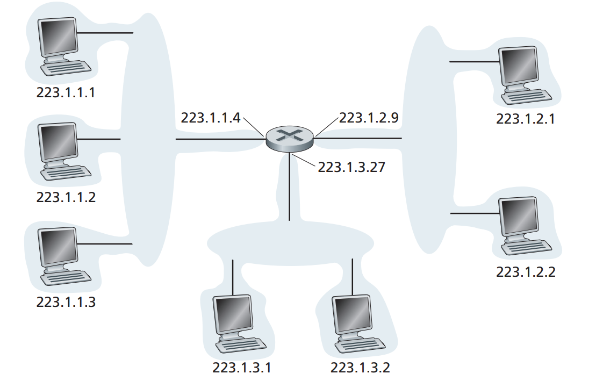

# Table of contents

- [Layer 3: Network layer: Data plane](#network)
- [Layer 3: Dataplane: Inside the router](#router)
- [Layer 3: IP protocols](#ip)
- [Layer 3: Network layer: Control Plane](#control)

In the [previous post](https://chophilip21.github.io/network_part2/), I have reviewed layers under application layer, like the transport layer. I will cover the remaining layers in this post. While working with VPN and SSH projects, I have already studied a lot of basic ideas related to networking, but network layers are arguably the most complex layer in the protocol stack according to the author, thus it is good idea to study it again throughly.

# 1.0 - Network Layer: Dataplane  

<figure>

<figcaption>Network layer can be decomposed into dataplane and control plane</figcaption>
</figure>

The author divides the Network layer into two parts:

- Data plane (**logics for individual router**, determines how datagram arriving on router input port is forwarded to router output port)
    - `Forwarding`: Move packets from router's input to appropriate router output
- Control plane (**logics for network-wide control of the flow of datagrams**, determines how datagram is routed among routers along end-end path from source host to destination host. )
    - `Routing`: Determine route taken by packets from source to destination

Some people use both terms (Forwarding, routing) interchangeably, but the author insists on clear distinctions b/w the two. 

We will look into Data planes first, but before we do dive into it, let's try to understand the ideas behind network layers. The purpose that the network layers serve is quite complex. In terms of just looking at primary goal, the main purpose is to transport segments from end-to-end.

<figure>

<figcaption>Final review of the OSI model</figcaption>
</figure>

On sending side, segments are encapsulated into datagrams and sent to next router. On receiving side, you get the datagrams from upstream router, and deliver decoded segments to segment layer. Routers examine header fields in all IP datagrams passing through it. 

But there are other service requirements that network layers should also fulfill:

-  `Guaranteed delivery`: This service guarantees that a packet sent by a source host will eventually arrive at the destination host.
- `Guaranteed delivery with bounded delay` : This service not only guarantees delivery of the packet, but delivery within a specified host-to-host delay bound (e.g, within 100 msec)
- `In-order packet delivery` : This service guarantees that packets arrive at the destination in the order that they were sent
- `Guaranteed minimal bandwidth` : This network-layer service emulates the behavior of a transmission link of a specified bit rate (for example, 1 Mbps) between sending and receiving hosts. As long as the sending host transmits bits below the specified bit rate, then all packets are eventually delivered to the destination host. 
- `Security`: The network layer could encrypt all datagrams at the source and decrypt them at the destination, thereby providing confidentiality to all transport-layer segments.

Above are partial list of services that <i>network could provide</i>. But in practice, guaranteeing all above service requirements in the network layer is very difficult, often not possible, and that is why we implement complex error checking logic in upper layers.  

## 1.1 - Dataplane: Inside the router 

Dataplane is all about forwarding datagrams to the router, thus it makes most sense to dig on the routers first. An important thing to understand is that **routers are essentially a specialized computers**. It has CPU and memory to temporarily and permanently store data to execute OS instructnions, such as system initialization, routhing functions, and switching functions. 

<figure>

<figcaption>Routers have CPU and RAM</figcaption>
</figure>

Routers have Ramdom Access Memory (RAM) for temporary storage of IP routing table, Ethernet ARP table, and running configuration files. It has Read-Only Memory (ROM) for storing permanent bootup instructions. It has Flash drive for storing IOS and other system related files. A router of course does not have video adapters or sound card adapters. Instead, routers have specialized ports and network interface cards to interconnect devices to other networks.

In terms of networking, there are four router components that can be identified:

1. `Input Ports`
2. `Switching Fabric`
3. `Output Ports`
4. `Routing processor`

<figure>

<figcaption>Router architecture is designed in a way that the routers are equipped to perform two main functions. 1. Process routable protocols, 2.Use routing protocols to determine the best path.</figcaption>
</figure>

**Input Ports**

Let's start from visiting what happens in the input ports. 
- Firstly, `Line termination` receives physical (analog) signals and turns them into digitial signals. Consider this as the reception stage. 
- Then, `data link processing layer` does decapsulation of the data. 
- Next, the `Lookup, forwarding` layer checks the `fowarding table` to see which packet should be forwarded to which output port via switching fabcric
- Forwarding table is usuauly computed/updated by local routing processor, copied from remote SDN controllers or other network routers
- Once forwarding table decides which output port to direct the inputs, inputs get sent to the `switching fabric` (or sometimes queued in the input port if router has scheduling mechanism).

<figure>

<figcaption>Input port processing</figcaption>
</figure>

**Switching fabric**
- Switching fabric is the connector b/w router's input ports and output ports. This is a heart of a router, that pumps blood (inputs from input ports) to other organs (output ports).

<figure>

<figcaption>There are three switch methods: switch by memory, switch by a bus, switch by interconnection network.</figcaption>
</figure>

- The actual process of `switching (forwarding)` can take multiple different approaches. 
- `Switching via memory` is a older method where switching b/w inputs and outputs is directly controlled by routing processor's CPU.   
- `Switching via a bus` is an approach where input port transfers a packet directly to output port over a shared bus, without intervention by routing processor, by prepending a switch internel label header to packets. All packets must cross single bus, so the switching speed is limited to the bus speed. 

<figure>

<figcaption>In computers, CPU, main memory, I/O devices are connected by lines called system bus. "Bus" is just a set of wires carrying bits to be shared by number of devices.</figcaption>
</figure>

- `Switching via interconnection network` is an approach of overcoming the bandwidth of single bus, using something called `crossbar`, like how multiprocessor computer architectures work. The idea is quite complex, and it's outside the scope of this research. Let's just keep in mind that it exists.  

**Output Port**

This is like the reverse of the input ports, as it takes packets that have been stored in the output port’s memory and transmits them over the output link. 

<figure>

<figcaption>Output port processing</figcaption>
</figure>

Similar to input port, queueing is often implemented to effciently resolve traffic load, and manage relative speed of switching fabric, line speed, etc. If the router's memory gets exhausted, `packet loss` will occur as there is no more available memory to store arriving packets. This is how packets are "lost in the network" or "dropped at a router". Again, specific queueing algorithms such as `active queue management (AQM)` or `Random Early Detection (RED)`within the router is out of the scope this blog post, so it will not be covered. Typical queueing strategies like FIFO (First in First out), round robin, and priority queues are used. 

**Routing processors**

The routing processor performs control-plane functions (which will be discussed later). In traditional routers, it executes the routing protocols, maintains routing tables and attached link state information, and computes the forwarding table for the router. 

## 1.2 - IP protocol 

Things like IPv4, IPv6, NAT, are topics that I have already covered across multiple other posts, like [here](https://chophilip21.github.io/openssh/). So to just fill up some of the gaps, length of IPv4 address are 32 bits, where each 4 decial numbers represent 4 bytes, (0-255).(0-255).(0.255).(0.255) - (in binary notation, something like 11000001 00100000 11011000 00001001). IPv6 will be 128 bits, but in this case, things like checksum is no longer required. 

<figure>

<figcaption>If the version is IPv4, both source and destination will be 32 bits.</figcaption>
</figure>

<figure>

<figcaption>Checksum is performed in both IP data and IP header.</figcaption>
</figure>

An interesting thing that can be noticed at this point is, <i>Why does TCP/IP perform error checking at both transport and network layers?</i> This is because:
- IP header is checksummed at the IP layer, while the TCP/UDP checksum is computed over the entire TCP/UDP segment
- IPv4 uses the checksum to detect corruption of packet headers. i.e. the source, destination, and other meta-data
- The TCP protocol includes an extra checksum that protects the packet "payload" as well as the header. So the entire thing!
- Checksum algorithms are identical for both

In terms of network interconnecting, group of hosts and router forms `subnet`. 

<figure>

<figcaption>A subnet is also called IP network. Think of this as a network within a network.</figcaption>
</figure>

A router assigns subnet an internal IP address via `subnet mask`, and hosts attached to this subnet will follow the IP pattern of the subnets like the above figure. Hosts within the same subnet can talk directly to each other without having to go through routers, just like how we made the [SSH connections](https://chophilip21.github.io/openssh_part3/) via VPN.

**Network Address Translation (NAT)**

This is another familar concept. IPV4 is limited in terms of availability, and when routers assign hosts private IP addresses using things like `Dynamic Host Configuration Protocol (DHCP)`, many hosts in the world will end-up with the same IP address, which makes it impossible for hosts to send and receive packets from the global Internet. NAT-enabled routers will allow hosts to access the internet via router's public IP, and any responses coming back from the internet will hit router's `NAT translation table` to direct the requests back to the hosts who requested.  

# 2.0 Network layer: Control Plane 

For the past few sections, we looked at the Data plane related concepts, which are things that's happening within individual routers, at a more micro-level. Now it's time to look at **Control Plane, which deals with the macro, network-wide logic** that not only controls how datagram is routed from one router to another, but also how each components and services are configured and managed. Control plane's main idea is regarding routing algorithms, where routers find the "best route" to deliver data, to minimize time delay and communication cost of packet transmission.    

