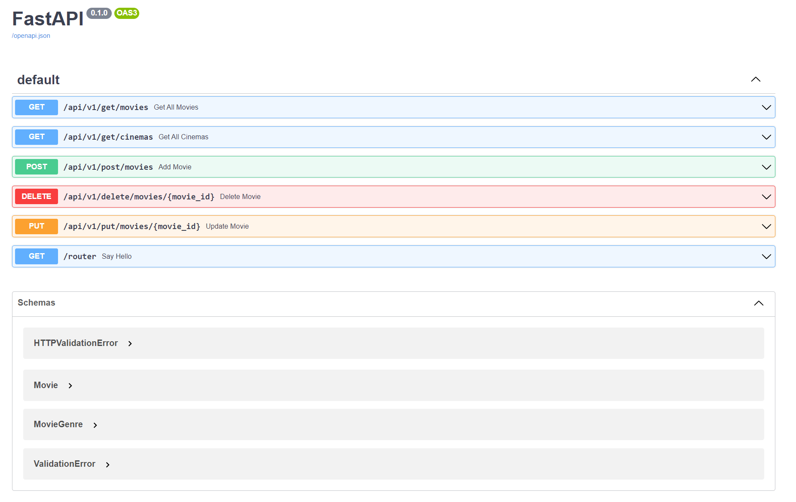

# Table of contents
- [REST (protocol vs architecture)](#rest)
- [What is RPC?](#rpc)
- [What is gRPC?](#grpc)
- [What are Websockets?](#rest_vs_socket)
- [Intro to REST API](#coding)
- [FastAPI Basic Examples](#example_1)

In my [previous blog post](https://chophilip21.github.io/network_part2/), I studied basics of networking from reading James F. Kurose's Networking Top Down Approach. After reading the texbook, I realized that the textbook does not address some of the common software engineering terms like REST, SOAP, Websocket, GraphQL, and etc. Obviously this isn't because of the author's ineptitude, but it's because architectural style or frameworks don't technically belong in the definition of OSI model. But they are very important topics without a question, and I would like to review various architectural styles and ways to code them using Python in this post.  

# 1.0 - REST (protocol vs architecture) <a name="rest"></a>

<figure>

<figcaption>OSI models can be interpreted in both directions, depending on who you are (sender vs receiver) </figcaption>
</figure>

OSI model explains concepts related to computer systems communicating over network. **A communication protocol is a system of rules (contract) that allows two or more entities of a communications system to transmit information via any kind of variation of a physical quantity. An architecture is how to best organize these protocols to create an efficient application.** REST (REpresentational State Transfer) is an architecture style (concept, not a contract), so it does not technically belong to OSI model according to the author. You can say it's imaginary layer 8 talking to layer 7. In application development, the only protocol that really belongs to the OSI application layer is HTTP protocol. But, you can picture everything like this:

- REST (Architecture, say layer 8.)
- HTTP (protocol. Layer 7.)
- SOAP (protocol that relies on others. Something like Layer 7.5)
- Websocket (protocol that relies on others. Something like Layer 7.5)
- gRPC (protocol that relies on others. Something like Layer 7.5)

Above isn't something that everyone would agree, but above is what makes sense to be the most. REST on the imaginary layer 8 doesn't care about the building materials per say, so it can be used with HTTP, FTP, or any other communication protocol. REST just happens to be very commonly used with HTTP. If you see a statements like [gRPC is 7 times faster than REST](https://blog.dreamfactory.com/grpc-vs-rest-how-does-grpc-compare-with-traditional-rest-apis/#:~:text=%E2%80%9CgRPC%20is%20roughly%207%20times,data%20for%20this%20specific%20payload.), this isn't the most accurate statement because REST is just a general style. 

<figure>

<figcaption>Conceptually, REST does not belong to OSI model. But could be seen as layer 8.</figcaption>
</figure>


To review some of the main conceptual ideas of REST:

- REST is architectural style, and HTTP is protocol. It imposes conditions on how an API should work. 
- REST API needs to ensure:
    - `Statelessness`: Every requests are treated independently, so if same request is made, it should return same request all the time. The state of client does not matter.
    - `Cacheable`: API must implement some caching algorithm to enhance performance
    - `Decoupled`: Client and server applications in REST design must always be independent of each other. That's why we have front-end and back-end.
    - `Layered`: REST style allows you to use layered system where you deploy API on server A, store data on server B, and authenticate in server C. 
- Standard RESTful API HTTP methods include POST, PUT, PATCH, GET, DELETE.
- Client sends requests typically in JSON format, which gets interpreted as HTTP requests by server. Server returns HTTP response, and API returns the HTTP response back in common formats like JSON/XML/HTML. 

<i>I will elaborate and create REST based applications on other blog posts, but not here. </i>

## 1.1 - RPC <a name="rpc"></a>

The term [gRPC](https://grpc.io/docs/languages/python/basics/) comes in many locations in system design. It's a protocol developed by Google in 2016, but it's based on pre-existing concept of `Remote Procedure Call (RPC)`. The history of RPC is very old.

<figure>

<figcaption>The idea of RPC goes back to 1980s, even before REST.</figcaption>
</figure>

RPC (remote Procedure call Protocol) is a remoting protocol that requests services from a remote computer program over a network without needing to know the underlying network technology. RPC is socket-based (will be discussed later), that is, working at the session level The RPC protocol assumes that some transport protocols exist, such as TCP or UDP, to carry information data between communication programs. So in terms of OSI model, you can say that RPC spans the transport and application tiers.

<figure>

<figcaption>In the simplest terms, RPCs enable you to connect to a network.</figcaption>
</figure>


The message structure of RPC requests are extremely simple, making it ideal microservcies exchanging many messages with each other. Client's request paramters are encoded from client stub, passed to server's stub to be decoded, and back and forth to exchange information. **Once a call is made in RPC, the calling environment is suspended while the process is handed over to the server and then executed. Once that procedure is finished, the results are shipped back to the client**. This is the query-response loop. RPC, therefore, excels in applications where control alternates between both parties. Execution in these implementations occurs synchronously.These custom contracts make RPC ideal for IoT applications — especially low-powered ones — where REST might otherwise struggle due to resource consumption. Conversely, REST truly excels in hypermedia-dependent scenarios, and scales extremely well. It can group many different resources together and serve them in the appropriate format to users.


## 1.2 - gRPC <a name="grpc"></a>

Now we have some idea about RPC, let's check what gRPC is. gRPC uses HTTP/2 protocols as transport protocol (TCP connection in the lower level), so it can be seen as layer 7.5 in the OSI model. Posts like [this](https://www.altexsoft.com/blog/what-is-grpc/) characterizes gRPC as architecture style like REST, but it's more of a protocol whether than a style. 

<figure>

<figcaption>gRPC is easily programmable using wrapper languages like Java, C++, Python and Go.</figcaption>
</figure>

gRPC leverages the simple, lightweight communication principle of RPC, and instead of JSON, gRPC messages are serialized using Protobuf, an efficient binary message format. Protobuf serializes very quickly on the server and client. Protobuf serialization results in small message payloads, important in limited bandwidth scenarios like mobile apps.

| Feature                 | gRPC                               |    HTTP    |
| :---------------------- | :--------------------------------- | :-------------------: |
| `Protocol`                | HTTP/2                           | HTTP |
| `Payload`                 | Protobuf                         |      JSON     |
| `Browser Support`         | No                               |      Yes     |

As you can see, gRPC extends HTTP/2 protocols. A major difference is the use of protobuf (protocol buffers). Parsing with Protocol Buffers is less CPU-intensive because data is represented in a binary format which minimizes the size of encoded messages. This means that message exchange happens faster, even in devices with a slower CPU like IoT or mobile devices. However, it's support for browsers are quite limited in many ways, and thus RESTful HTTP protocols are still being used in many areas despite the speed advantage of gRPC.  


## 1.3 - Websockets <a name="rest_vs_socket"></a>

Similar to gRPC, websocket can be seen as part of the application layer, extending HTTP protocols. WebSockets is communication channel, typically run from browsers connecting to Application Server over a protocol similar to HTTP that runs over TCP/IP, which is why it's called **websocket**. Below is an important picture to keep in mind:

<figure>

<figcaption>Websocket communicates over persistent TCP connection</figcaption>
</figure>

1. All webSocket connections start with an HTTP request with a header that requests an upgrade to the webSocket protocol. If the receiving server agrees, then the two sides switch protocols from HTTP to webSocket and from then on the connection uses the webSocket protocol
2. **An HTTP starts sending data as responses only when a request is received, whereas Websockets send and receives data based on data availability**. This is why for cases like chat-apps, which requires bi-directional real time communication, websockets are preferred over http based communication. 
2. websockets are over persistent TCP CONNECTION, whereas HTTP/2.0 requests are not necessarily persistent. But they are both over TCP connection.
3. It makes no sense to compare REST and Websockets, as that is not comparing apples to apples.
4. **Websockets and Sockets are completely different concepts.**


# 2.0 - Intro to REST API <a name="coding"></a>

I have briefly touched upon REST APIs theories, and now it's time to build one!

My knowledge for building REST APIs are quite rusty, as the last time I coded any RESTful application was during my studies at SFU for a class project, which is years back. Surprisingly for my jobs I never really had to build one, so I definitely need to review it now as it doesn't make sense for a software developer to not know how to build one. In terms of the backend framework, I have experience with `Flask` in the past, and it is more than sufficient for proof of concepts. But I always wanted to try learning how to use [Fast API](https://fastapi.tiangolo.com/tutorial/#install-fastapi), as I heard that it has much smoother learning curve than `Django`, and much faster speed as it is light-weighted. Plus I will be working on things that are beyond proof of concepts, so I thought it would be great to tackle some new stuff at this point. 


## 2.1 - FastAPI basic examples <a name="example_1"></a>

Running FastAPI Hello World very easy.

```py 
from fastapi import FastAPI

app = FastAPI()


@app.get("/")
async def root():
    return {"message": "to be or not to be"}

# uvicorn sample_1:app --reload
# http://127.0.0.1:8000/docs ---> Integrates well with the swagger dashboard. 
```

And it integrates nicely with the [Swagger UI](https://swagger.io/tools/swagger-ui/) interactive session, very powerful way to debug your code. 

use `async` when you need support for `await`. Otherwise `def` is totally fine. Read [here](https://fastapi.tiangolo.com/async/) for concurrency and parallelism, otherwise no need for now. It seems it's not really important which one you choose at the moment. 

**Let's code our own example: Movies**. Codes can be found [here](https://github.com/chophilip21/chophilip21.github.io/blob/master/_posts/rest_api_part1/sample_2.py).

Now we are going to work with other methods in RESTful application: `PUT`, `POST`, `DELETE`. If you are building an application or a web API, it’s rarely the case that you can put everything on a single file. So in order to keep all the files working as an application as a whole, we define a `APIRouter` and call the router across multiple modules. Additionally, the data structure gets managed with [Pydantic](https://docs.pydantic.dev/install/). Pydantic acts as an intuitive data validator, which allows you to pass datatypes like statically typed languages, or dynamically typed languages using `Optional` keyword. 

Defined dummy Movie class (with Enum for genre) and Cinema class using Pydantic:

```py
class MovieGenre(str, Enum):
    """Movie genre enum"""

    action = "action"
    comedy = "comedy"
    horror = "horror"
    romance = "romance"
    thriller = "thriller"
    drama = "drama"


class Movie(BaseModel):
    """Movie model"""

    id: Optional[str] = None  # Optional[int] is equivalent to Union[int, None]
    Name: str
    rating: Union[int, float]  # use Union to allow multiple types
    director: str
    genre: MovieGenre  # use MovieGenre enum


class Cinema(BaseModel):
    """Cinema model. Recursively use Movie model."""

    id: int
    Name: str
    location: str
    movies: list[Movie]  # use list[Movie] to specify a list of Movie objects
```

We are not using any DB at the moment, so create a temporary list that can store the data. Lets make unique ids with UUID. And add some dummy data that goes with it:

```py
# create a list of dummy movies
dummy_movies: List[Movie] = [
    Movie(
        id=str(uuid.uuid4()),
        Name="The Shawshank Redemption",
        rating=9.2,
        director="Frank Darabont",
        genre=MovieGenre.drama,
    ),
    Movie(
        id=str(uuid.uuid4()),
        Name="The Godfather",
        rating=9.2,
        director="Francis Ford Coppola",
        genre=MovieGenre.drama,
    ),
    Movie(
        id=str(uuid.uuid4()),
        Name="The Dark Knight",
        rating=9.0,
        director="Christopher Nolan",
        genre=MovieGenre.action,
    ),
    Movie(
        id=str(uuid.uuid4()),
        Name="Lost in translation",
        rating=8.3,
        director="Sofia Coppola",
        genre=MovieGenre.romance,
    ),
]

# create a list of dummy cinemas
cinema_list: List[Cinema] = [
    Cinema(
        id=str(uuid.uuid4()),
        Name="Cinema 1",
        location="Location 1",
        movies=random.sample(dummy_movies, 3),
    ),
    Cinema(
        id=str(uuid.uuid4()),
        Name="Cinema 2",
        location="Location 2",
        movies=random.sample(dummy_movies, 2),
    ),
]

```

Code should be self-explanatory. To make things a little more interesting, Cinemas will randomly get assigned movies from the movie list. And now lets create very basic method that returns all possible cinemas and movies. 

```py
@app.get("/api/v1/get/movies", status_code=200)
async def get_all_movies():
    """Get all movies"""
    return dummy_movies

@app.get("/api/v1/get/cinemas", status_code=200)
async def get_all_cinemas():
    """Get all movies"""
    return cinema_list
```

And check the output by starting up the application and accessing the url. You should get something like this:

```bash
curl -X 'GET' \
  'http://127.0.0.1:8000/api/v1/cinemas' \
  -H 'accept: application/json'

[
  {
    "id": "56b799c8-37a5-4589-af25-e50fe746a4c1",
    "Name": "Cinema 1",
    "location": "Location 1",
    "movies": [
      {
        "id": "168c414d-8a42-4009-a82f-24d47740a3e4",
        "Name": "The Dark Knight",
        "rating": 9,
        "director": "Christopher Nolan",
        "genre": "action"
      },
      {
        "id": "292239f8-4fa2-47a8-aaa2-cf8a9dad230e",
        "Name": "Lost in translation",
        "rating": 8,
        "director": "Sofia Coppola",
        "genre": "romance"
      },
    ]
  },
]
```

Awesome. Now let's add functions that are little more interesting. Let's add a `POST` method to add some data to our list. Instead of `app.get`, all we have to do is define `app.post`. 201 is the convention for creating a new content. 

```py
@app.post("/api/v1/post/movies", status_code=201)
async def add_movie(movie: Movie):
    """Add a movie"""
    dummy_movies.append(movie)
    return {"id": movie.id, "message": "Movie added successfully"}
```

Unlike simple `GET` function that returns an object upon reaching endpoint, above won't work as it is without passing JSON body. Use API clients like `Postman` or `Thunderbolt`. Let's post below. 

```py
{
"id": "989450b2-9256-431b-976e-a274ac67ec72",
"Name": "ocean's eleven",
"rating": 9,
"director": "Steven Soderbergh",
"genre": "action"
}
```

If you post it, and hit the endpoint for getting movies, you should see the new entries poping up. 
Now let's also implement `DELETE`. The difference here is that we have a dynamic parameter in the endpoint for the user ID, so that you can delete specific entry--Ocean's eleven that we just added. 

```py
@app.delete("/api/v1/delete/movies/{movie_id}", status_code=200)
async def delete_movie(movie_id: str):
    """Delete a movie"""
    for movie in dummy_movies:
        if movie.id == movie_id:
            dummy_movies.remove(movie)
            return {"id": movie.id, "message": "Movie deleted successfully"}
    raise HTTPException(status_code=404, detail="Movie not found")

# Pretty self explanatory. The endpoint we want to hit is: http://127.0.0.1:8000/api/v1/delete/movies/989450b2-9256-431b-976e-a274ac67ec72
```

Note, when the url does not exist, **we need to raise appropriate error**.
you need to return [proper codes](https://www.restapitutorial.com/httpstatuscodes.html):
- Informational responses (100 – 199)
- Successful responses (200 – 299)
- Redirection messages (300 – 399)
- Client error responses (400 – 499)
- Server error responses (500 – 599)

Awesome. It deletes when the url exists, and correctly returns can't delete message (Error 404) when no matching url is found.  Finally, the last part of the code is updating using `PUT`. The way it works, is similar to how `POST` work. 

```py
@app.put("/api/v1/put/movies/{movie_id}", status_code=200)
async def update_movie(movie_id: str, movie: Movie):
    """Update a movie"""
    for index, movie in enumerate(dummy_movies):
        if movie.id == movie_id:
            # override the index when matches.
            dummy_movies[index] = movie
            return {"id": movie.id, "message": "Movie updated successfully"}
    raise HTTPException(status_code=404, detail="Movie not found")
```

You need to provide id to the endpoint, and when particular ID matches to that in the tmp db, replace it with the JSON body that you are providing. 

```py
@app.put("/api/v1/put/movies/{movie_id}")
async def update_movie(movie_id: str, movie_obj: Movie):
    """Update a movie"""
    for index, movie in enumerate(dummy_movies):
        if movie.id == movie_id:
            dummy_movies[index] = movie_obj
            return {"id": movie.id, "message": "Movie updated successfully"}
    raise HTTPException(status_code=404, detail="Movie not found")
```

Fairly straight forward! Instead of providing the entire JSON body, if you can patch certain objects partially by calling `PATCH` as well. Okay so we now have some idea about the basics of FAST API. 


<figure>

<figcaption>Fast API Swagger dashboard should look like this.</figcaption>
</figure>

On the next post, I will take API coding to the next level, and probably a good idea is to have a seperate repository for that instead of adding all the files under blog posts. Other topics like `gRPC` or `Websocket` programming will be created as seperate posts. 
